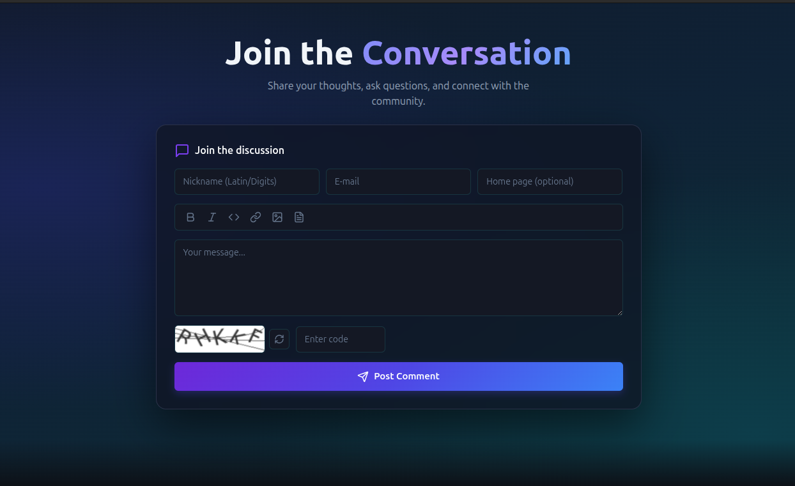
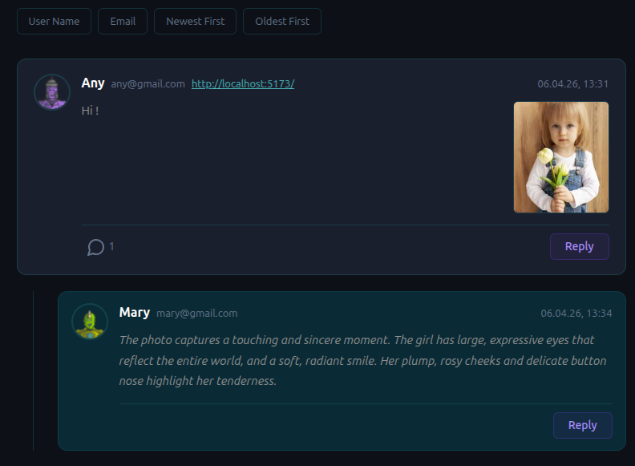
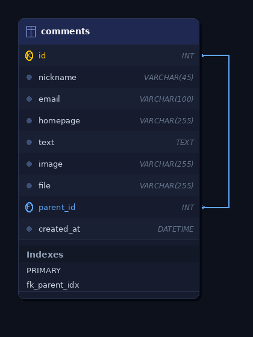

## Comment Board (Django, DRF, Vue)

📄 **Additional project details:** [DETAILS.md](docs/DETAILS.md)

🌐 **Live demo:** [your-app.onrender.com](https://comments-spa.vercel.app/)

| Main Page | Comment Thread |
|:---------:|:--------------:|
|  |  |

**Database Schema**
<div align="center">
  
</div>
### Start-up instructions

> 💡 **Prerequisites:** Make sure [Docker](https://docs.docker.com/get-started/get-docker/) is installed and running.

1. **Clone the repository:**
    ```bash
    git clone https://github.com/KravtsovVadym/django-spa-comments
    ```
    ```bash
    cd django-spa-comments
    ```

2. **Configuration:**
    ```bash
        cp backend/.env.example backend/.env
        cp frontend/.env.example frontend/.env
    ```
3. Generate a secret key and paste it into `.env` as    `SECRET_KEY`:
    ```bash
        python -c "from django.core.management.utils import get_random_secret_key; print(get_random_secret_key())"
    ```
4. **Build and start all services:**
    ```bash
    docker compose up --build
    ```

5. **Open in browser:**

| Service | URL |
|---------|-----|
| Frontend | http://localhost:5173 |
| Backend API | http://localhost:8000/api/ |
| WebSocket | ws://localhost:8000/ws/comments/ |


### Tech Stack

| Layer | Tools |
|-------|-------|
| Backend | [Django 5](https://docs.djangoproject.com/en/5.2/) · [DRF](https://www.django-rest-framework.org/) · [Daphne](https://github.com/django/daphne) |
| WebSockets | [Django Channels](https://channels.readthedocs.io/) · [Redis](https://redis.io/docs/) |
| Caching | [django-cacheops](https://github.com/Suor/django-cacheops) |
| Security | [django-simple-captcha](https://django-simple-captcha.readthedocs.io/) |
| Database | [PostgreSQL](https://www.postgresql.org/docs/) · [psycopg2](https://www.psycopg.org/docs/) |
| Media | [Cloudinary](https://cloudinary.com/documentation) · [Pillow](https://pillow.readthedocs.io/) |
| Static | [WhiteNoise](https://whitenoise.readthedocs.io/) |
| Frontend | [Vue 3](https://vuejs.org/guide/introduction) · [Vite](https://vitejs.dev/guide/) · [Axios](https://axios-http.com/docs/intro) |
| UI | [Bootstrap 5](https://getbootstrap.com/docs/5.3/) · [Lucide Vue](https://lucide.dev/guide/packages/lucide-vue-next) · [DOMPurify](https://github.com/cure53/DOMPurify) |
| Infra | [Docker](https://docs.docker.com/) · [Docker Compose](https://docs.docker.com/compose/) · [Render](https://render.com/docs) |